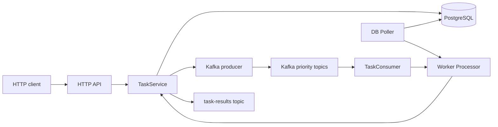
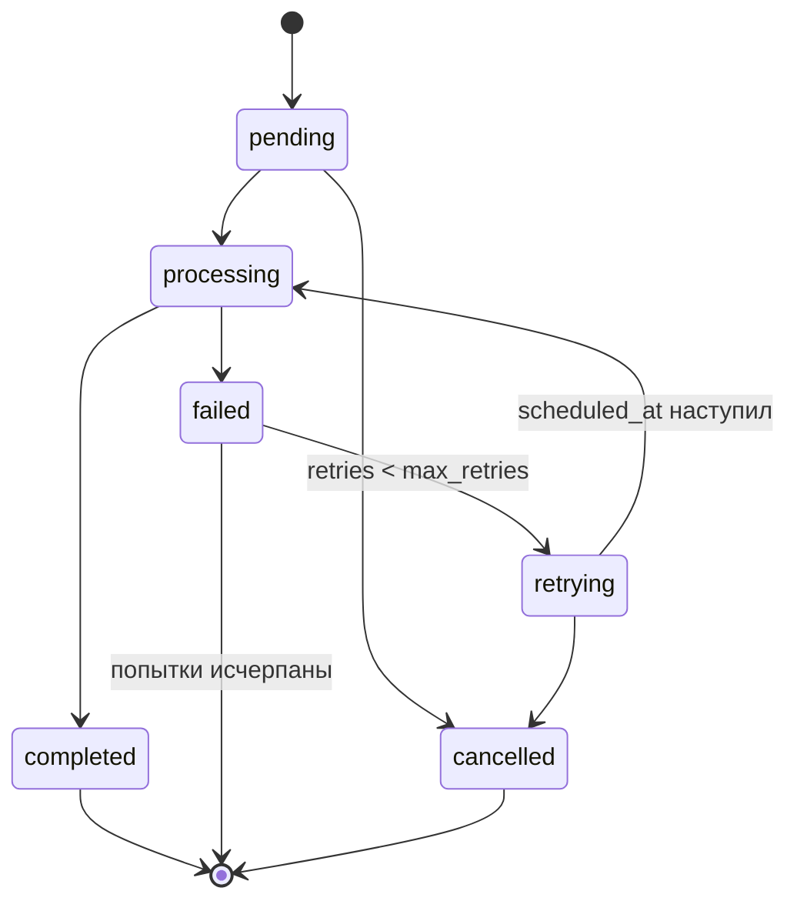

# Руководство по изучению `go-taskflow`

## 1. Что это за проект

`go-taskflow` — сервис очереди фоновых задач на Go. Клиент создаёт задачу через HTTP API, задача сохраняется в PostgreSQL и, если её уже можно выполнять, публикуется в Kafka. Worker получает задачу из Kafka либо находит её напрямую в PostgreSQL, атомарно захватывает, запускает обработчик и сохраняет результат.

Проект полезно изучать как пример следующих тем:

- слоистой архитектуры Go-приложения;
- разделения domain, service, repository и transport;
- работы с PostgreSQL через `sqlx`;
- Kafka producer и consumer groups через Sarama;
- конкурентной обработки и защиты от дубликатов;
- scheduled tasks и retry с exponential backoff;
- HTTP API на стандартном `net/http`;
- graceful shutdown и распространения `context.Context`;
- unit- и integration-тестов.

При этом проект ещё развивается. Outbox, сохранение metadata/history, реальные Prometheus-метрики и настоящие обработчики email/webhook/image-задач пока не завершены. Это важно: часть кода показывает работающий основной pipeline, а часть — подготовленные точки расширения.

## 2. Архитектура одним взглядом



Основная идея архитектуры:

```text
cmd                 сборка приложения и управление жизненным циклом
internal/transport  входы и выходы: HTTP и Kafka
internal/service    сценарии работы с задачами
internal/domain     бизнес-модель и её правила
internal/repository интерфейсы хранения данных
internal/repository/postgres
                    SQL-реализация repository
internal/worker     надёжный жизненный цикл выполнения задачи
internal/pkg        общая инфраструктура: config, database, logger
```

Зависимости в основном направлены снаружи внутрь:

```text
transport / cmd / worker
          ↓
       service
          ↓
 domain + repository interfaces
          ↑
 PostgreSQL implementation
```

## 3. Главная сущность: Task

Начинать изучение следует с файлов:

1. `internal/domain/types.go`
2. `internal/domain/task.go`
3. `internal/domain/errors.go`
4. `internal/domain/task_test.go`

### 3.1. Типы задач

Сейчас известны шесть типов:

```text
image_resize
image_convert
send_email
generate_report
data_export
webhook
```

`TaskType` является строковым типом со своими `IsValid`, `Scan` и `Value`. Методы `Scan` и `Value` позволяют использовать тип вместе с `database/sql`.

### 3.2. Приоритеты

```text
0 = low
1 = normal
2 = high
3 = critical
```

High и critical отправляются в `tasks-high`, normal — в `tasks-normal`, low — в `tasks-low`.

Разделение по Kafka-топикам позволяет независимо масштабировать обработку разных приоритетов. При этом внутри PostgreSQL ожидающие задачи сортируются по `priority DESC, created_at ASC`.

### 3.3. Статусы



Статусы:

- `pending` — задача ожидает обработки;
- `processing` — задача захвачена worker’ом;
- `completed` — завершена успешно;
- `failed` — обработчик завершился ошибкой;
- `retrying` — назначена следующая попытка;
- `cancelled` — задача отменена.

Обратите внимание на два уровня управления статусами:

- domain-методы `MarkAsProcessing`, `MarkAsCompleted`, `MarkAsFailed`;
- orchestration в `TaskService.UpdateTaskStatus` и `TaskService.RetryTask`.

Это полезное место для анализа. В будущем правила переходов лучше централизовать, чтобы service не мог обходить domain-инварианты.

## 4. Как создаётся задача

Полный путь следует читать в таком порядке:

```text
POST /api/v1/tasks
  → httpapi.API.createTask
  → TaskService.CreateTask
  → domain.NewTask
  → TaskRepository.Create
  → TaskProducer.PublishTask
```

### Шаг 1. HTTP API

Файл: `internal/transport/httpapi/api.go`.

Пример запроса:

```json
{
  "type": "webhook",
  "priority": 1,
  "payload": {
    "url": "https://example.com/hook",
    "event": "order.created"
  },
  "max_retries": 3
}
```

API:

- ограничивает тело запроса;
- запрещает неизвестные JSON-поля;
- по умолчанию назначает normal priority;
- преобразует `payload` в `json.RawMessage`;
- передаёт transport DTO в `service.CreateTaskRequest`;
- преобразует domain task обратно в HTTP response.

Отдельный `taskResponse` нужен потому, что обычный `[]byte` кодировался бы стандартным JSON encoder как base64. Использование `json.RawMessage` сохраняет payload как JSON-объект.

### Шаг 2. Service

Файл: `internal/service/task_service.go`.

`CreateTask`:

1. проверяет запрос;
2. создаёт domain task;
3. назначает UUID и trace ID;
4. сохраняет задачу в PostgreSQL;
5. публикует немедленную задачу в Kafka;
6. оставляет scheduled task только в БД до наступления `scheduled_at`.

PostgreSQL здесь является постоянным источником состояния. Kafka используется для быстрой доставки события worker’у.

### Шаг 3. Repository

Файлы:

- `internal/repository/interface.go`;
- `internal/repository/postgres/task_repository.go`;
- `internal/repository/postgres/models.go`.

Интерфейс `TaskRepository` не знает о SQL. Реализация PostgreSQL преобразует domain model во внутренний `dbTask`, чтобы корректно работать с nullable-полями и JSONB.

При чтении обратите внимание на:

- `toDBTask` и `toDomainTask`;
- преобразование `JSONB`;
- обработку `sql.ErrNoRows`;
- преобразование PostgreSQL unique violation в `ErrTaskAlreadyExists`;
- whitelist `order_by` и `order_dir`.

### Шаг 4. Kafka producer

Файлы:

- `internal/transport/kafka/producer/producer.go`;
- `internal/transport/kafka/producer/task_producer.go`;
- `internal/transport/kafka/converter/converter.go`;
- `internal/transport/kafka/messages/messages.go`.

Низкоуровневый `Producer` работает поверх `sarama.AsyncProducer`, но метод `SendMessage` ждёт конкретное подтверждение от Kafka. Для связи отправленного сообщения с ответом producer использует `ProducerMessage.Metadata` и внутренний канал результата.

Это важный фрагмент для изучения конкурентного Go:

```text
caller → producer.Input()
              ↓
       Sarama async producer
          ↙            ↘
   Successes()       Errors()
          ↘            ↙
       delivery result channel
              ↓
           caller
```

Простое помещение сообщения в `Input()` ещё не означает, что Kafka его приняла. Проект ждёт broker acknowledgement либо возвращает timeout/error.

## 5. Как worker обрабатывает задачу

Читайте файлы в следующем порядке:

1. `cmd/worker/main.go`
2. `internal/transport/kafka/consumer/task_consumer.go`
3. `internal/transport/kafka/consumer/consumer.go`
4. `internal/worker/processor.go`
5. `internal/repository/postgres/task_repository.go`, метод `LockTaskForProcessing`
6. `internal/worker/poller.go`

### 5.1. Два источника задач

Worker получает задачи двумя путями:

- Kafka consumer — быстрый основной путь;
- PostgreSQL poller — fallback и scheduler.

DB poller нужен в двух случаях:

1. публикация в Kafka не состоялась, но задача уже сохранена в БД;
2. `scheduled_at` наступил и задачу теперь можно выполнять.

Оба пути вызывают один и тот же `Processor.HandleTask`.

### 5.2. Атомарный захват

Ключевой SQL находится в `LockTaskForProcessing`:

```sql
UPDATE tasks
SET status = 'processing',
    worker_id = $2,
    started_at = NOW(),
    updated_at = NOW()
WHERE id = $1
  AND status IN ('pending', 'retrying')
  AND (scheduled_at IS NULL OR scheduled_at <= NOW())
RETURNING ...;
```

Если два worker’а одновременно получили одну задачу, только один `UPDATE` удовлетворит условию. Второй не получит строку и воспримет сообщение как harmless duplicate.

Это обеспечивает модель at-least-once delivery с идемпотентным захватом на уровне БД.

### 5.3. Processor

`internal/worker/processor.go` отделяет инфраструктурный жизненный цикл от бизнес-обработчика.

```go
type TaskHandler interface {
    HandleTask(ctx context.Context, task *domain.Task) ([]byte, error)
}
```

Последовательность выполнения:

```text
claim task
   ↓
call TaskHandler
   ├─ success → completed → save result → publish task-results
   └─ error   → failed
                  ├─ retries remain → retrying + scheduled_at
                  └─ exhausted      → terminal failed
```

Текущий handler в `cmd/worker/main.go` является инфраструктурным примером. Он проверяет валидность JSON и возвращает receipt:

```json
{
  "task_id": "...",
  "type": "webhook",
  "processed_at": "..."
}
```

Он не выполняет настоящий HTTP webhook, не отправляет email и не обрабатывает изображения. Для реальной задачи этот handler нужно заменить dispatcher’ом по `TaskType`.

### 5.4. Kafka offset

В `Consumer.ConsumeClaim` offset отмечается только после успешного завершения handler’а. Если handler возвращает инфраструктурную ошибку до надёжного сохранения результата, claim завершается без продвижения offset и Kafka сможет доставить сообщение повторно.

Если обработчик завершился бизнес-ошибкой, но Processor успешно сохранил `failed/retrying`, Processor возвращает `nil`: входное Kafka-сообщение уже можно подтвердить, потому что решение о retry находится в PostgreSQL.

## 6. Scheduled tasks и retry

Kafka timestamp сам по себе не является таймером доставки. Поэтому будущая задача не публикуется в Kafka сразу.

Механизм scheduled task:

```text
API создаёт task с scheduled_at
  → task сохраняется как pending
  → Kafka publication пропускается
  → Poller вызывает ListPending
  → до scheduled_at SQL не возвращает задачу
  → после scheduled_at Processor захватывает задачу
```

Механизм retry:

```text
handler error
  → status = failed
  → retries++
  → status = retrying
  → scheduled_at = now + 2^retries seconds
  → Poller ждёт наступления scheduled_at
```

Backoff ограничен пятью минутами.

Обратите внимание: в Kafka-слое всё ещё существует `tasks-retry`, но текущий основной retry-flow worker’а опирается на PostgreSQL poller. Это одна из областей, которую можно упростить или переосмыслить.

## 7. HTTP API

Entrypoint: `cmd/api/main.go`.

Маршруты:

| Метод | Путь | Назначение |
|---|---|---|
| `POST` | `/api/v1/tasks` | создать задачу |
| `GET` | `/api/v1/tasks` | получить список |
| `GET` | `/api/v1/tasks/{id}` | получить задачу |
| `POST` | `/api/v1/tasks/{id}/retry` | вручную повторить failed task |
| `POST` | `/api/v1/tasks/{id}/cancel` | отменить задачу |
| `GET` | `/api/v1/tasks/stats` | получить статистику |
| `GET` | `/health/live` | процесс API жив |
| `GET` | `/health/ready` | PostgreSQL доступен |

Фильтры списка:

```text
status=pending,retrying
type=webhook,send_email
priority=1,2
worker_id=...
trace_id=...
created_from=RFC3339
created_to=RFC3339
limit=25
offset=0
order_by=created_at|updated_at|priority
order_dir=asc|desc
```

Middleware реализует:

- генерацию или принятие `X-Request-ID`;
- добавление request ID в logger context;
- access log;
- восстановление после panic;
- единый JSON-формат ошибок.

`/health/live` не проверяет внешние зависимости. `/health/ready` вызывает `DB.HealthCheck`. Kafka пока не входит в readiness response, хотя API создаёт Kafka producer при запуске.

## 8. PostgreSQL

Основная миграция: `migrations/000001_create_tasks_table.up.sql`.

Таблицы:

```text
tasks
├── task_metadata
└── task_history
```

### tasks

Хранит текущее состояние задачи, payload, result, retry counters и timestamps.

Полезные индексы:

- partial index по ожидающим статусам;
- priority index;
- composite queue index;
- индексы по type, worker_id, trace_id и scheduled_at.

### task_metadata

Предназначена для дополнительных key-value данных задачи.

### task_history

Предназначена для audit trail переходов статусов.

Репозитории metadata и history уже существуют, но `TaskService` пока не вызывает их. В частности, `CreateTask` заполняет `task.Metadata` в памяти, однако `TaskRepository.Create` не сохраняет эту map в `task_metadata`.

## 9. Конфигурация

Читайте:

1. `internal/pkg/config/config.go`
2. `internal/pkg/config/loader.go`
3. `configs/config.yaml`
4. `configs/config.development.yaml`
5. `configs/config.production.yaml`
6. `.env.example`

Приоритет конфигурации:

```text
defaults
  < configs/config.yaml
  < configs/config.<APP_ENV>.yaml
  < TASKQUEUE_* environment variables
```

Если передан `CONFIG_PATH`, загружается именно этот файл, а environment-specific YAML его не заменяет.

Примеры env-переменных:

```bash
export APP_ENV=development
export TASKQUEUE_DATABASE_HOST=localhost
export TASKQUEUE_KAFKA_BROKERS=localhost:9092
export TASKQUEUE_SERVER_HTTP_PORT=8081
export TASKQUEUE_WORKER_CONCURRENCY=5
```

Viper преобразует точки в `_`, поэтому `database.max_open_conns` становится `TASKQUEUE_DATABASE_MAX_OPEN_CONNS`.

## 10. Локальный запуск

### Требования

- Go версии из `go.mod`;
- Docker и Docker Compose;
- свободные порты PostgreSQL и Kafka.

### 10.1. Инфраструктура

```bash
make infra-up
```

Команда запускает:

- PostgreSQL;
- Kafka;
- Kafka UI;
- Prometheus;
- Grafana;
- создание Kafka topics.

### 10.2. Миграции

```bash
make migrate-up
make migrate-version
```

### 10.3. API

Kafka UI уже занимает порт `8080`, а development API по умолчанию тоже использует `8080`. Поэтому для одновременного локального запуска задайте API другой порт:

```bash
TASKQUEUE_SERVER_HTTP_PORT=8081 go run ./cmd/api
```

Файл `.env.example` является примером, но loader сам по себе не читает `.env`. Переменные нужно экспортировать или передать процессу явно.

### 10.4. Worker

В другом терминале:

```bash
go run ./cmd/worker
```

### 10.5. Создание задачи

```bash
curl -i -X POST http://localhost:8081/api/v1/tasks \
  -H 'Content-Type: application/json' \
  -d '{
    "type": "webhook",
    "priority": 2,
    "payload": {
      "url": "https://example.com/hook",
      "event": "study.demo"
    }
  }'
```

Скопируйте `id` из ответа.

```bash
curl -s http://localhost:8081/api/v1/tasks/<TASK_ID>
curl -s 'http://localhost:8081/api/v1/tasks?status=completed&order_by=created_at&order_dir=desc'
curl -s http://localhost:8081/api/v1/tasks/stats
```

В Kafka UI можно наблюдать сообщения в priority topic и `task-results`. В PostgreSQL можно сравнить состояние до и после выполнения:

```bash
docker exec -it task-queue-postgres \
  psql -U taskqueue -d taskqueue \
  -c "SELECT id, type, status, priority, retries, worker_id, scheduled_at FROM tasks ORDER BY created_at DESC LIMIT 10;"
```

## 11. Как правильно изучать проект

Не пытайтесь читать файлы по алфавиту. Изучайте один рабочий сценарий за раз.

### Этап A. Domain model

Прочитайте:

```text
internal/domain/types.go
internal/domain/task.go
internal/domain/task_test.go
```

Ответьте себе:

1. Какие статусы терминальные?
2. Когда `CanRetry` возвращает true?
3. Почему priority реализован отдельным типом?
4. Какие инварианты проверяет `Validate`?

Запустите:

```bash
go test -v ./internal/domain
```

### Этап B. Persistence

Прочитайте:

```text
migrations/000001_create_tasks_table.up.sql
internal/repository/interface.go
internal/repository/postgres/models.go
internal/repository/postgres/task_repository.go
```

Сначала проследите только методы `Create`, `Get` и `LockTaskForProcessing`. После этого переходите к dynamic filters, stats и bulk operations.

Вопросы:

1. Почему repository возвращает domain task, а не `dbTask`?
2. Что произойдёт при одновременном lock из двух goroutine?
3. Зачем queue index является partial?
4. Почему имена колонок сортировки нельзя передавать SQL-параметром?

### Этап C. Kafka message flow

Читайте:

```text
internal/transport/kafka/messages/messages.go
internal/transport/kafka/converter/converter.go
internal/transport/kafka/config/config.go
internal/transport/kafka/producer/producer.go
internal/transport/kafka/producer/task_producer.go
internal/transport/kafka/consumer/consumer.go
internal/transport/kafka/consumer/task_consumer.go
```

Вопросы:

1. Чем domain task отличается от Kafka `TaskMessage`?
2. Для чего используются Kafka headers?
3. Почему async producer требует отдельных goroutine для Successes и Errors?
4. В какой момент consumer имеет право вызвать `MarkMessage`?
5. Что произойдёт при повторной доставке уже выполненной задачи?

### Этап D. Service orchestration

Прочитайте `internal/service/inreface.go` и `internal/service/task_service.go`.

Для каждого публичного метода составьте таблицу:

| Метод | Читает БД | Пишет БД | Пишет Kafka | Меняет статус |
|---|---:|---:|---:|---:|
| `CreateTask` | нет | да | иногда | создаёт pending |
| `GetTask` | да | нет | нет | нет |
| `ProcessTask` | да | да | нет | processing |
| `UpdateTaskStatus` | да | да | terminal result | да |
| `RetryTask` | да | да | нет | retrying |
| `CancelTask` | да | да | нет | cancelled |

После этого подумайте, какие операции должны быть одной транзакцией.

### Этап E. Worker lifecycle

Читайте:

```text
internal/worker/processor.go
internal/worker/processor_test.go
internal/worker/poller.go
cmd/worker/main.go
```

Сначала разберите unit-тесты Processor. Они короче реализации и показывают четыре ожидаемых сценария:

- success;
- retryable failure;
- exhausted retries;
- duplicate delivery.

### Этап F. HTTP transport

Читайте сначала `internal/transport/httpapi/api_test.go`, затем `api.go` и `server.go`.

Тесты показывают внешний контракт яснее, чем реализация:

- какие URL используются;
- какой JSON ожидается;
- как выглядят ошибки;
- как проверяется readiness;
- почему unsafe ordering отклоняется.

### Этап G. Composition roots

Только теперь прочитайте:

```text
cmd/api/main.go
cmd/worker/main.go
cmd/migrator/main.go
```

`main.go` отвечает не за бизнес-логику, а за composition root:

- загрузку конфигурации;
- создание конкретных реализаций;
- связывание интерфейсов;
- запуск процессов;
- graceful shutdown.

## 12. Как работать с тестами

Быстрая проверка без внешней инфраструктуры:

```bash
go test -race -short ./...
go vet ./...
go build ./...
```

PostgreSQL и Kafka integration tests пропускаются в short mode.

После запуска инфраструктуры:

```bash
go test -race ./internal/repository/postgres
go test -race ./internal/transport/kafka/producer
go test -race ./internal/transport/kafka/consumer
```

Полный Kafka integration test следует сначала внимательно проверить: consumer-тест ожидает сообщение с определённым ID, а создание и очистка тестовых сообщений/consumer group должны быть изолированы, чтобы результат не зависел от предыдущего состояния локального Kafka.

Полезный порядок при изменении кода:

```text
1. написать или изменить узкий unit test;
2. запустить тест одного package;
3. запустить go test -race -short ./...;
4. запустить go vet ./...;
5. проверить go build ./....
```

## 13. Практические упражнения

### Простые

1. Добавьте новый task type `cleanup_files` во все необходимые слои.
2. Добавьте фильтр `scheduled_before` в HTTP API и repository.
3. Добавьте endpoint удаления задачи и корректный `404`.
4. Исправьте опечатку `Strinf` у `TaskStatus`, предварительно добавив тест.
5. Сделайте API port `8081` стандартным development-значением, чтобы убрать конфликт с Kafka UI.

### Средние

1. Реализуйте `TaskHandler` dispatcher с отдельным handler для каждого `TaskType`.
2. Напишите handler для webhook с timeout, ограничением response body и проверкой HTTP status.
3. Добавьте recovery зависших `processing` tasks по lease timeout.
4. Интегрируйте `TaskHistoryRepository` во все переходы статусов.
5. Сохраняйте metadata атомарно вместе с задачей.
6. Добавьте проверку Kafka в readiness.

### Продвинутые

1. Реализуйте transactional outbox между PostgreSQL и Kafka.
2. Добавьте отдельный outbox publisher с `FOR UPDATE SKIP LOCKED`.
3. Сделайте идемпотентность создания через client-provided idempotency key.
4. Добавьте optimistic version или строгую state transition модель.
5. Реализуйте Prometheus metrics для API, producer, consumer, poller и processor.
6. Добавьте end-to-end тест в Docker: HTTP create → worker → completed result.

## 14. Что в проекте пока не завершено

При изучении важно не принимать каждую существующую структуру за полностью подключённую функцию.

### Нет transactional outbox

Сохранение задачи и публикация в Kafka выполняются двумя отдельными операциями. Если публикация не удалась, DB poller всё равно обработает задачу, поэтому задача не теряется, но отсутствует строгий журнал событий и гарантированная публикация Kafka-события.

### Metadata не сохраняется при создании

`Task.Metadata` существует, таблица и repository существуют, но service пока их не связывает.

### History не заполняется

Таблица и `TaskHistoryRepository` подготовлены, но переходы статусов не создают audit records.

### Бизнес-обработчики демонстрационные

Worker создаёт receipt, а не выполняет email/webhook/image operation.

### Prometheus и tracing не подключены

Конфигурация и Docker-контейнеры существуют, но приложение ещё не экспортирует настоящие `/metrics`, а tracing settings не создают spans.

### Readiness проверяет только PostgreSQL

Kafka producer необходим API и worker, но текущий health response не проверяет его состояние после запуска.

### Нет authentication и rate limiting

HTTP API следует считать внутренним development API.

### Нет обработки stale processing tasks

Если worker завершится после установки `processing`, но до сохранения результата, задача останется processing. Нужны lease/heartbeat либо периодический recovery.

## 15. Полезная мысленная модель

Рассматривайте PostgreSQL и Kafka как инструменты с разными ролями:

```text
PostgreSQL
  отвечает на вопрос: «каково текущее долговечное состояние задачи?»

Kafka
  отвечает на вопрос: «как быстро уведомить worker, что появилась работа?»

Processor
  отвечает на вопрос: «кто имеет право выполнить задачу и как сохранить исход?»

TaskHandler
  отвечает на вопрос: «что конкретно означает выполнить эту задачу?»
```

Если держать это разделение в голове, большая часть архитектурных решений становится понятной.

## 16. Рекомендуемый итоговый маршрут

```text
День 1: domain + migration
День 2: repository + SQL locking
День 3: Kafka messages, producer acknowledgements, consumer offsets
День 4: TaskService + retry/scheduling
День 5: Processor + Poller + concurrency
День 6: HTTP API + middleware + tests
День 7: запустить end-to-end и реализовать одно упражнение
```

После такого прохода вы должны уметь без подсказки объяснить:

1. почему задача сначала сохраняется в PostgreSQL;
2. почему Kafka-сообщение может прийти дважды;
3. как SQL lock предотвращает двойное выполнение;
4. почему future Kafka timestamp не решает delayed delivery;
5. когда Kafka offset можно подтвердить;
6. чем infrastructure error отличается от durable business failure;
7. где подключать новый реальный TaskHandler;
8. зачем проекту следующим этапом нужен outbox.
